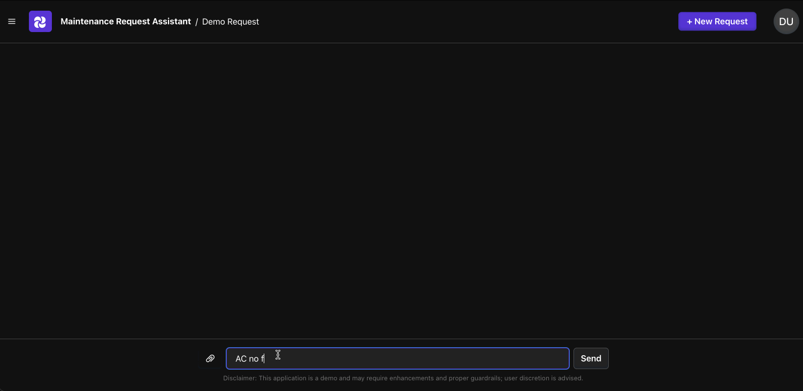
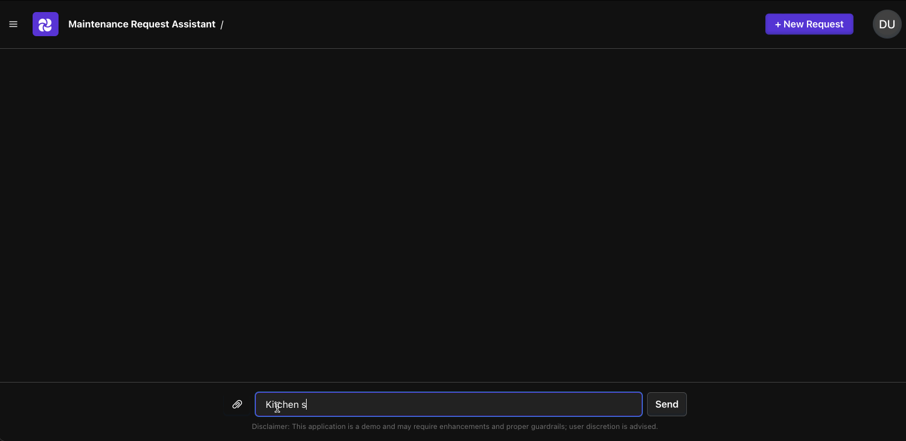
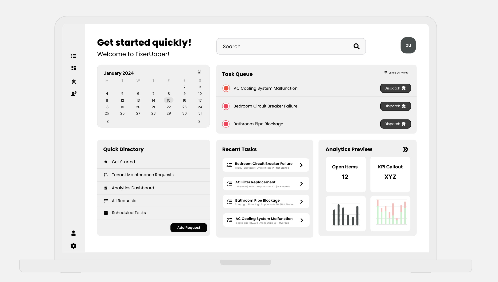

<a name="readme-top"></a>

<!-- [![Contributors][contributors-shield]][contributors-url]
[![Forks][forks-shield]][forks-url]
[![Stargazers][stars-shield]][stars-url]
[![Issues][issues-shield]][issues-url]
[![LinkedIn][linkedin-shield]][linkedin-url] -->

<!-- PROJECT LOGO -->
<br />
<div align="center">
  <h2 align="center">Oikos - Property Management Application</h2>

  <p align="center">
    A property managment application to facilitate maintenance requests / work order management.
    <br />
    <a href="https://github.com/neilneuwirth/property-manager"><strong>Explore the module »</strong></a>
    <a href="https://github.com/neilneuwirth/property-manager-api"><strong>Explore the API »</strong></a>
    <!-- <br />
    <br />
    <a href="https://github.com/othneildrew/Best-README-Template">View Demo</a>
    ·
    <a href="https://github.com/othneildrew/Best-README-Template/issues">Report Bug</a>
    ·
    <a href="https://github.com/othneildrew/Best-README-Template/issues">Request Feature</a> -->
  </p>
</div>

<!-- TABLE OF CONTENTS -->
<details>
  <summary>Table of Contents</summary>
  <ol>
    <li>
      <a href="#about-the-project">About The Project</a>
    </li>
    <li><a href="#roadmap">Roadmap</a></li>
    <li>
      <a href="#getting-started">Getting Started</a>
      <ul>
        <li><a href="#prerequisites">Prerequisites</a></li>
        <li><a href="#installation">Installation</a></li>
      </ul>
    </li>
    <li><a href="#built-with">Built With</a></li>
    <li><a href="#contact">Contact</a></li>
  </ol>
</details>

<!-- ABOUT THE PROJECT -->

## About The Project
#### Oikos Assistant: A Conversational AI Agent for Facilitating Maintenance Support and Requests
<br>

**Multilingual Support**: Multilingual support for bridging communication gaps among stakerholders
<br>

**Business Data Integration**: Enhanced with business data to empower tenants for self-service and better requirements gathering


<p align="right">(<a href="#readme-top">back to top</a>)</p>

<!-- ROADMAP -->

## Roadmap

### Completed Features

- [x] **Tenant Portal**: A dedicated interface for tenants to manage their maintenance requests.
- [x] **API Services with Telemetry**: Robust FastAPI backend services with integrated telemetry for monitoring and analytics.
- [x] **Multi-language Support**: Making the application accessible to a wider audience using LLMs.
  - [x] Spanish: Implemented Spanish language support.
- [x] **Buildium Integration**: Integration with Buildium property management software.

### Upcoming Features
- [ ] **Deploy Services**: Deploy application and API services to AWS services staging account. 
- [ ] **Property Manager Portal**: A dashboard for property managers to oversee maintenance request and analytics. 
- [ ] **Yardi Integration**: Integration with Yardi systems.
- [ ] **Twilio Integration for Vendor/Maintenance Dispatching**: Utilize Twilio services for efficient communication with vendors and maintenance staff. 
- [ ] **Appfolio Integration**: Integration with Appfolio.

### Future Enhancments
- [ ] **Tenant Portal Features**: Add features for tenants to view live progress of work orders, provide a review, and view historical requests. 
- [ ] **Vendor Portal**: A portal for vendors to receive work orders, submit invoices, and communicate with property managers.

### Long-term vision
- [ ] **Marketplace**
- [ ] **Below-the-line prescriptive analytics and reporting**
- [ ] **Work order cost projections**

<p align="right">(<a href="#readme-top">back to top</a>)</p>


## Property Manager Dashboard Sneak Peek 
<!-- PROPERTY MANAGER PREVIEW -->
<a href="https://app.uizard.io/p/d2e04da3">

</a>
<p align="right">(<a href="#readme-top">back to top</a>)</p>

<!-- GETTING STARTED -->

## Getting Started

These instructions will guide you through the process of setting up a local copy of the project for development and testing purposes.

### Prerequisites

Before you begin, ensure you have met the following requirements:

- You have a valid OpenAI subscription. To use the API, you need to set your API key as an environment variable. Replace `YOUR_OPENAI_API_KEY` with your actual API key:

  ```bash
  export OPENAI_API_KEY="YOUR_OPENAI_API_KEY"
  ```

### Installation

Follow these steps to get your development environment set up:

1. Clone the repository:

   ```sh
   git clone https://github.com/neilneuwirth/property-manager-app.git
   ```

2. Navigate to the project directory:

   ```sh
   cd webui
   ```

3. Install the required packages using Poetry:

   ```sh
   poetry install
   ```

4. Activate the Poetry shell to use the virtual environment:

   ```sh
   poetry shell
   ```

5. Initialize and run the application with Reflex:

   ```sh
   reflex init
   reflex run
   ```

**Note:** Ensure that you have Poetry installed on your system before proceeding with the installation steps. If you don't have Poetry, you can install it by following the instructions on the [official Poetry website](https://python-poetry.org/docs/#installation).

<p align="right">(<a href="#readme-top">back to top</a>)</p>

<!-- BUILT WITH -->

## Built With

This project is built on top of the [Property Manager API](https://github.com/neilneuwirth/property-manager-api) services repository, utilizing the [Property Manager](https://github.com/neilneuwirth/property-manager) module. Below is a list of major frameworks and libraries that have been used in the development of this project:

- [Property Manager](https://github.com/neilneuwirth/property-manager) - A module for property management tasks.
- [Reflex](https://reflex.dev/)
- [FastAPI](https://fastapi.tiangolo.com/)

<p align="right">(<a href="#readme-top">back to top</a>)</p>
<!-- CONTACT -->

## Contact

- **Neil Neuwirth**
  - 📧 [Email](mailto:neil.neuwirth15@gmail.com)
  - 🔗 LinkedIn: [Neil Max Neuwirth](https://www.linkedin.com/in/neil-max-neuwirth-840a4872/)
  - 🐱 GitHub: [@neilneuwirth](https://github.com/neilneuwirth)

<p align="right">(<a href="#readme-top">back to top</a>)</p>


<!-- MARKDOWN LINKS & IMAGES -->
<!-- https://www.markdownguide.org/basic-syntax/#reference-style-links -->

[contributors-shield]: https://img.shields.io/github/contributors/othneildrew/Best-README-Template.svg?style=for-the-badge
[contributors-url]: https://github.com/othneildrew/Best-README-Template/graphs/contributors
[forks-shield]: https://img.shields.io/github/forks/othneildrew/Best-README-Template.svg?style=for-the-badge
[forks-url]: https://github.com/othneildrew/Best-README-Template/network/members
[stars-shield]: https://img.shields.io/github/stars/othneildrew/Best-README-Template.svg?style=for-the-badge
[stars-url]: https://github.com/othneildrew/Best-README-Template/stargazers
[issues-shield]: https://img.shields.io/github/issues/othneildrew/Best-README-Template.svg?style=for-the-badge
[issues-url]: https://github.com/othneildrew/Best-README-Template/issues
[license-shield]: https://img.shields.io/github/license/othneildrew/Best-README-Template.svg?style=for-the-badge
[license-url]: https://github.com/othneildrew/Best-README-Template/blob/master/LICENSE.txt
[linkedin-shield]: https://img.shields.io/badge/-LinkedIn-black.svg?style=for-the-badge&logo=linkedin&colorB=555
[linkedin-url]: https://www.linkedin.com/in/neil-max-neuwirth-840a4872/
